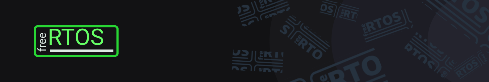

## FreeRTOs com ESP32

Este repostório é destinado ao armazenamento dos arquivos de projetos e exercícios desenvolvidos durante o curso de FreeRTOs com ESP32.

    

 
 

Durante o curso foram abordados os conceitos de:
- [ ] Tasks
- [ ] Sistemas single e multi-thread
- [ ] Requisições HTTP com FreeRTOS

## :weight_lifting: Exercícios

- [Criando Tasks](./tasks)
- [Conexão HTTPS](./socket_https)
- [Conexão HTTPS com FreeRTOS](./https_FreeRTOS)