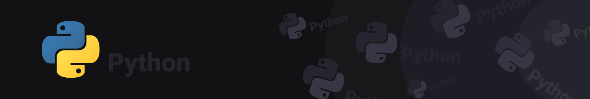

## Python for C developers

This repository aims to store the files of projects and exercises developed during the Python language course.

    

 
 

During the course, the concepts of: 
- [x] Python Classes 
- [x] Public and private variables 
- [x] Python inheritance 

## :weight_lifting: Exercícios

- [Python Classes](./01_Criacao_de_classes)
- [Private variables](./02_Variaveis_privadas)
- [Public variables](./03_Variaveis_publicas)
- [Python inheritance](./04_Heranca)
- [Inheritance - Method overload](./05_Sobrecarga_de_metodos)
- [Memory allocation](./06_Alocacao_memoria)
- [Threads](./07_Threads)