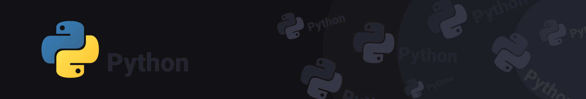

## Python para desenvolvedores C

Este repostório é destinado ao armazenamento dos arquivos de projetos e exercícios desenvolvidos durante o curso de linguagem Python do curso.

    

 
 

Durante o curso foram abordados os conceitos de:
- [x] Classes
- [x] Variáveis públicas e privadas
- [x] Herança em Python

## :weight_lifting: Exercícios

- [Classes](./01_Criacao_de_classes)
- [Variáveis Privadas](./02_Variaveis_privadas)
- [Variáveis Públicas](./03_Variaveis_publicas)
- [Herança](./04_Heranca)
- [Herança - Sobrecarga de métodos](./05_Sobrecarga_de_metodos)
- [Alocação de memória](./06_Alocacao_memoria)
- [Threads](./07_Threads)
