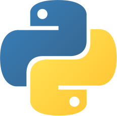

## ESP-IDF para aplicações IoT
Este repositório armazena os códigos de exemplo e projetos desenvolvidos durante a realização do curso `Formação em Internet das Coisas com ESP32` da [Microgenios](https://www.microgenios.com.br/).

  

 
 

  <a href="#sparkles-overview">Overview</a>&nbsp;&nbsp;&nbsp;|&nbsp;&nbsp;&nbsp;
  <a href="#jigsaw-tecnologias-abordadas">Tecnologias abordadas</a>&nbsp;&nbsp;&nbsp;|&nbsp;&nbsp;&nbsp;
  <a href="#spiral_calendar-ementa-do-treinamento">Ementa do treinamento</a>&nbsp;&nbsp;&nbsp;|&nbsp;&nbsp;&nbsp;
  <a href="#books-cursos">Cursos</a>&nbsp;&nbsp;&nbsp;

## :sparkles: Overview
O treinamento é composto por diversos cursos e seminários, abordando uma ampla variedade de assuntos relacionados a sistemas embarcados e IoT. 
O assunto principal dos projetos é a utilização do ESP32 em conjunto com a programação nativa em C com o uso do framework [ESP-IDF](https://docs.espressif.com/projects/esp-idf/en/latest/esp32/).

### :jigsaw: Tecnologias abordadas
- ESP32
- ESP-IDF SDK
- FreeRTOS
- API WebSocket
- Broker MQTT
- Rede LoRa
- Amazon AWS

## :spiral_calendar: Ementa do treinamento
- ESP32 - Programação Nativa C/C++ com SDK-IDF Espressif
- Desenvolvimento de Plataforma IoT na Amazon AWS e ESP32
- Utilização do FreeRTOS (Sistema Operacional de Tempo Real) com ESP32
- Automação Residencial com ESP8266 e WiFi. Consumo de uma API WebSocket
- Implementação de Interface FrontEnd WebSocket com PHP, Mysql e ESP32
- Raspberry Pi - Projetos Avançados com Broker MQTT e WebSocket
- IHM WEB Industrial - Desenvolvimento de Interface Gráfica Web Industrial
- Programação Nativa do ESP8266 com SDK-IDF em C/C++. Criação de WebServer e WiFimanger do Zero
- Ethernet Cabeada com ESP32 e SDK-IDF C/C++
- Rede Mesh com ESP32 e SDK-IDF C/C++
- Projetos Rede LoRa com ESP32 e SDK-IDF C/C++

## :books: Cursos

 - <a href="./C-ANSI"> C ANSI</a>
 
 - <a href="./Python_for_C_developers"> Python para desenvolvedores C/C++</a>
 
 - <a href="./FreeRTOS">FreeRTOS com ESP32 (Arduino Core)</a>
